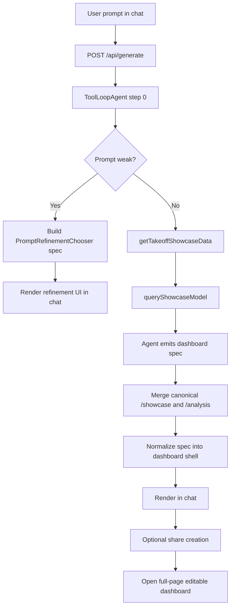

# APS Dashboard Showcase

A Next.js + AI SDK application for generating **viewer-first BIM dashboards** from a fixed Autodesk Platform Services showcase model.

This repo started from the `vercel-labs/json-render` chat example and has been refocused into a single-purpose dashboard product:

- chat asks are converted into dashboard specs
- dashboards are rendered with `@json-render/react` + `@json-render/shadcn`
- the Autodesk Viewer is always a primary part of the layout
- shared dashboards can be opened full-page and edited visually

## What This App Does

The app is intentionally narrow:

- it generates **APS showcase dashboards only**
- it queries a **normalized local dataset** derived from a fixed Autodesk model
- it renders dashboards with a **standardized shell**
- it supports **prompt refinement** for weak prompts before generation
- it supports **full-page editing** for shared dashboards

The app is not meant to be a general chatbot, multi-model BIM explorer, or freeform design surface.

## Product Shape

There are two main user experiences:

1. **Chat generation**
   - user sends a prompt
   - the agent decides whether the prompt needs refinement
   - if needed, the app shows a prompt refinement chooser
   - otherwise the agent queries the model data and generates a dashboard spec
   - the dashboard renders inline in chat

2. **Shared full-page dashboard**
   - a generated dashboard can be shared
   - the shared page renders the dashboard full width
   - an editor sidebar allows reordering, removing, adding, and retargeting supported widgets
   - edits auto-save back to the share

## Tech Stack

- **Framework**: Next.js App Router
- **AI runtime**: Vercel AI SDK (`ToolLoopAgent`)
- **Model gateway**: Vercel AI Gateway
- **Structured UI**: `@json-render/core`, `@json-render/react`, `@json-render/shadcn`
- **Charts**: Recharts
- **3D / Viewer**: Autodesk Viewer + React Three Fiber for some registry components
- **Storage for shares**: Upstash Redis when configured, otherwise local file fallback
- **Rate limiting**: Upstash Ratelimit when configured

## Getting Started

```bash
pnpm install
cp .env.example .env.local
pnpm dev
```

Open [http://localhost:3000](http://localhost:3000).

### Scripts

- `pnpm dev` – run Next.js locally
- `pnpm dev:portless` – run with `portless` if that is part of your local workflow
- `pnpm build` – production build
- `pnpm start` – run the production build
- `pnpm check-types` – TypeScript typecheck
- `pnpm lint` – ESLint
- `pnpm build:showcase-data` – rebuild the normalized APS showcase dataset

## Environment Variables

Core AI settings:

- `AI_GATEWAY_API_KEY`
- `AI_GATEWAY_MODEL`
  - main dashboard generation model
- `AI_GATEWAY_PROMPT_REFINEMENT_MODEL`
  - optional separate model for weak-prompt detection and prompt refinement
  - defaults to `openai/gpt-5-nano` in code if unset

APS settings:

- `APS_CLIENT_ID`
- `APS_CLIENT_SECRET`
- `APS_SHOWCASE_URN`

Optional infrastructure:

- `KV_REST_API_URL`
- `KV_REST_API_TOKEN`
- `RATE_LIMIT_PER_MINUTE`
- `RATE_LIMIT_PER_DAY`
- `SHARE_TTL_SECONDS`

See [/.env.example](/Users/mr/code/json-render-dashboard/.env.example).

## Architecture Overview

At a high level, the app has five layers:

1. **Chat transport**
2. **Agent orchestration**
3. **Showcase data querying**
4. **JSON spec normalization + rendering**
5. **Share / full-page editing**

### 1. Chat Transport

Main files:

- [/Users/mr/code/json-render-dashboard/app/page.tsx](/Users/mr/code/json-render-dashboard/app/page.tsx)
- [/Users/mr/code/json-render-dashboard/app/api/generate/route.ts](/Users/mr/code/json-render-dashboard/app/api/generate/route.ts)

The chat page uses `useChat` from `@ai-sdk/react` with `DefaultChatTransport` pointed at `/api/generate`.

The server route:

- validates incoming UI messages
- applies rate limits
- runs the agent
- intercepts prompt-refinement results
- merges streamed UI message parts into the client response

### 2. Agent Orchestration

Main file:

- [/Users/mr/code/json-render-dashboard/lib/agent.ts](/Users/mr/code/json-render-dashboard/lib/agent.ts)

The app uses `ToolLoopAgent` from the AI SDK.

The agent is constrained to one product contract:

- generate APS showcase dashboards only
- always include the Autodesk Viewer
- use a standard dashboard shell
- stop early when the prompt needs refinement

The important tool sequence is:

1. `assessPromptRefinement`
2. `getTakeoffShowcaseData`
3. `queryShowcaseModel`

The first step is forced with `prepareStep(...)`. If the assessment says the prompt is too weak, the route emits a dedicated refinement UI instead of continuing to dashboard generation.

### 3. Prompt Refinement

Main files:

- [/Users/mr/code/json-render-dashboard/lib/tools/assess-prompt-refinement.ts](/Users/mr/code/json-render-dashboard/lib/tools/assess-prompt-refinement.ts)
- [/Users/mr/code/json-render-dashboard/lib/chat/prompt-refinement.ts](/Users/mr/code/json-render-dashboard/lib/chat/prompt-refinement.ts)
- [/Users/mr/code/json-render-dashboard/lib/chat/types.ts](/Users/mr/code/json-render-dashboard/lib/chat/types.ts)

Weak prompt detection is **AI-driven**, not heuristic-only.

Flow:

- the first agent tool call evaluates the latest user prompt
- if the prompt is too weak for reliable BIM dashboard generation, the tool returns:
  - `needsRefinement`
  - a reason
  - 3–5 stronger prompt options
- the route turns that into a `PromptRefinementChooser` spec
- the client renders that chooser inline in chat

Important design choice:

- the **model chooses the refined prompt options**
- the **app chooses the UI component**

That means the content is dynamic, but the prompt refinement UX stays consistent.

### 4. Showcase Data Querying

Main files:

- [/Users/mr/code/json-render-dashboard/lib/tools/showcase-model-query.ts](/Users/mr/code/json-render-dashboard/lib/tools/showcase-model-query.ts)
- [/Users/mr/code/json-render-dashboard/lib/aps/showcase-query.ts](/Users/mr/code/json-render-dashboard/lib/aps/showcase-query.ts)
- [/Users/mr/code/json-render-dashboard/lib/aps/showcase-dataset.ts](/Users/mr/code/json-render-dashboard/lib/aps/showcase-dataset.ts)
- [/Users/mr/code/json-render-dashboard/data/aps/showcase/README.md](/Users/mr/code/json-render-dashboard/data/aps/showcase/README.md)

The data layer works against a **pre-normalized local dataset**, not directly against a live model query service.

`queryShowcaseModel` exposes filter inputs such as:

- `categories`
- `families`
- `types`
- `levels`
- `materials`
- `activities`
- `search`

`queryShowcaseTakeoff(...)` returns:

- `summary`
- `facets`
- `grouped`
  - `byType`
  - `byLevel`
  - `byMaterial`
  - `byActivity`
- `rows`
- `viewer`

Those outputs become the canonical `/analysis` state for charts, filters, tables, and viewer interactions.

### 5. JSON Render Pipeline

Main files:

- [/Users/mr/code/json-render-dashboard/lib/render/catalog.ts](/Users/mr/code/json-render-dashboard/lib/render/catalog.ts)
- [/Users/mr/code/json-render-dashboard/lib/render/registry.tsx](/Users/mr/code/json-render-dashboard/lib/render/registry.tsx)
- [/Users/mr/code/json-render-dashboard/lib/render/renderer.tsx](/Users/mr/code/json-render-dashboard/lib/render/renderer.tsx)
- [/Users/mr/code/json-render-dashboard/lib/render/normalize-showcase-spec.ts](/Users/mr/code/json-render-dashboard/lib/render/normalize-showcase-spec.ts)
- [/Users/mr/code/json-render-dashboard/lib/render/merge-showcase-tool-state.ts](/Users/mr/code/json-render-dashboard/lib/render/merge-showcase-tool-state.ts)

This layer is where a streamed model spec becomes the final UI.

#### Catalog

The catalog defines which components the model is allowed to generate, including:

- `ShowcaseDashboardLayout`
- `AutodeskViewer`
- `Metric`
- chart components
- inputs / slicers
- tables
- prompt-refinement chooser

#### Registry

The registry maps those schema types to real React components.

This is also where much of the product behavior lives:

- dashboard shell layout
- chart interactions
- Autodesk viewer interactions
- selection inspector
- editable full-page widgets
- table rendering
- prompt refinement chooser rendering

#### Normalization

The model does not render directly. Specs are normalized first.

`normalizeShowcaseDashboardSpec(...)` is responsible for:

- coercing freeform outputs into the standardized shell
- ensuring viewer visibility
- ensuring minimum filter coverage
- upgrading or inserting fallback detail panels
- repairing grouped `dbIds` for viewer-linked interactions
- bypassing shell normalization for non-dashboard specs like `PromptRefinementChooser`

#### Canonical Tool State

The app does **not** trust the model to own `/showcase` or `/analysis`.

`mergeShowcaseToolStateIntoSpec(...)` overwrites those parts of spec state from the actual tool outputs in the streamed message parts. That ensures the final UI is bound to canonical tool results rather than model-authored copies.

## Request Lifecycle

Here is the full generation flow:



## Dashboard Layout Contract

The app standardizes dashboards around `ShowcaseDashboardLayout`.

The expected section order is:

1. filters
2. KPI strip
3. viewer panel
4. primary analytics panel
5. secondary analytics panel
6. detail panel A
7. detail panel B

This contract is enforced partly in prompting and partly in normalization.

The current product decisions include:

- viewer is always pinned as a primary section
- dashboards stay horizontally organized on desktop
- filters remain visible
- KPI cards are compact and standardized
- bottom detail panels are deterministic:
  - full element schedule
  - grouped summary table

## Viewer and Visual Interactions

The rendered dashboard supports linked interactions:

- chart clicks isolate elements in the viewer
- grouped summary row clicks isolate elements in the viewer
- detail row clicks focus selected elements
- repeated click on the same target clears the active isolate/selection
- the selection inspector below the viewer updates from viewer or visual interactions

Most of this behavior lives in:

- [/Users/mr/code/json-render-dashboard/lib/render/registry.tsx](/Users/mr/code/json-render-dashboard/lib/render/registry.tsx)
- [/Users/mr/code/json-render-dashboard/components/autodesk-viewer.tsx](/Users/mr/code/json-render-dashboard/components/autodesk-viewer.tsx)

## Sharing and Full-Page Editing

Main files:

- [/Users/mr/code/json-render-dashboard/app/api/shares/route.ts](/Users/mr/code/json-render-dashboard/app/api/shares/route.ts)
- [/Users/mr/code/json-render-dashboard/app/api/shares/[shareId]/route.ts](/Users/mr/code/json-render-dashboard/app/api/shares/[shareId]/route.ts)
- [/Users/mr/code/json-render-dashboard/lib/shares.ts](/Users/mr/code/json-render-dashboard/lib/shares.ts)
- [/Users/mr/code/json-render-dashboard/app/dashboards/[shareId]/page.tsx](/Users/mr/code/json-render-dashboard/app/dashboards/[shareId]/page.tsx)
- [/Users/mr/code/json-render-dashboard/components/shared-dashboard-editor.tsx](/Users/mr/code/json-render-dashboard/components/shared-dashboard-editor.tsx)
- [/Users/mr/code/json-render-dashboard/lib/render/dashboard-layout-editor.ts](/Users/mr/code/json-render-dashboard/lib/render/dashboard-layout-editor.ts)

### Share storage

Shares are stored using:

- Upstash Redis when configured
- in-memory + `/.cache/shares` fallback when Redis is not configured

### Shared dashboard page

The shared page loads a saved spec and renders it in a full-page editor.

The editor supports:

- collapsing sidebar
- reordering widgets
- changing chart type for editable widgets
- removing widgets
- adding supported widget types
- auto-save on change

The viewer is intentionally pinned and non-removable.

## Repository Structure

```text
app/
  api/
    generate/                 Chat generation endpoint
    shares/                   Share create/get/update endpoints
  dashboards/[shareId]/       Full-page shared dashboards
  page.tsx                    Chat UI

components/
  autodesk-viewer.tsx         Autodesk viewer wrapper
  shared-dashboard-editor.tsx Full-page dashboard editor
  ui/                         shadcn-based UI primitives

data/
  aps/showcase/               Normalized showcase data and docs

lib/
  agent.ts                    ToolLoopAgent setup and instructions
  aps/                        APS auth, dataset loading, query logic, URN helpers
  chat/                       Prompt refinement types + logic
  render/                     Catalog, registry, renderer, normalization, editor helpers
  shares.ts                   Share persistence
  tools/                      AI SDK tools exposed to the agent
```

## Important Files to Know

If you are changing behavior, these are the first files to inspect:

### Product / generation behavior

- [/Users/mr/code/json-render-dashboard/lib/agent.ts](/Users/mr/code/json-render-dashboard/lib/agent.ts)
- [/Users/mr/code/json-render-dashboard/app/api/generate/route.ts](/Users/mr/code/json-render-dashboard/app/api/generate/route.ts)

### Prompt refinement

- [/Users/mr/code/json-render-dashboard/lib/chat/prompt-refinement.ts](/Users/mr/code/json-render-dashboard/lib/chat/prompt-refinement.ts)
- [/Users/mr/code/json-render-dashboard/lib/tools/assess-prompt-refinement.ts](/Users/mr/code/json-render-dashboard/lib/tools/assess-prompt-refinement.ts)

### Rendering and shell behavior

- [/Users/mr/code/json-render-dashboard/lib/render/normalize-showcase-spec.ts](/Users/mr/code/json-render-dashboard/lib/render/normalize-showcase-spec.ts)
- [/Users/mr/code/json-render-dashboard/lib/render/registry.tsx](/Users/mr/code/json-render-dashboard/lib/render/registry.tsx)
- [/Users/mr/code/json-render-dashboard/lib/render/catalog.ts](/Users/mr/code/json-render-dashboard/lib/render/catalog.ts)

### Data querying

- [/Users/mr/code/json-render-dashboard/lib/tools/showcase-model-query.ts](/Users/mr/code/json-render-dashboard/lib/tools/showcase-model-query.ts)
- [/Users/mr/code/json-render-dashboard/lib/aps/showcase-query.ts](/Users/mr/code/json-render-dashboard/lib/aps/showcase-query.ts)

### Sharing and editing

- [/Users/mr/code/json-render-dashboard/lib/shares.ts](/Users/mr/code/json-render-dashboard/lib/shares.ts)
- [/Users/mr/code/json-render-dashboard/components/shared-dashboard-editor.tsx](/Users/mr/code/json-render-dashboard/components/shared-dashboard-editor.tsx)
- [/Users/mr/code/json-render-dashboard/lib/render/dashboard-layout-editor.ts](/Users/mr/code/json-render-dashboard/lib/render/dashboard-layout-editor.ts)

## Common Customization Points

### Change prompt suggestions

Edit:

- [/Users/mr/code/json-render-dashboard/app/page.tsx](/Users/mr/code/json-render-dashboard/app/page.tsx)

### Change the dashboard shell

Edit:

- [/Users/mr/code/json-render-dashboard/lib/render/catalog.ts](/Users/mr/code/json-render-dashboard/lib/render/catalog.ts)
- [/Users/mr/code/json-render-dashboard/lib/render/registry.tsx](/Users/mr/code/json-render-dashboard/lib/render/registry.tsx)
- [/Users/mr/code/json-render-dashboard/lib/render/normalize-showcase-spec.ts](/Users/mr/code/json-render-dashboard/lib/render/normalize-showcase-spec.ts)

### Change which model is used

Use env vars:

- `AI_GATEWAY_MODEL`
- `AI_GATEWAY_PROMPT_REFINEMENT_MODEL`

### Change data returned to charts/tables

Edit:

- [/Users/mr/code/json-render-dashboard/lib/tools/showcase-model-query.ts](/Users/mr/code/json-render-dashboard/lib/tools/showcase-model-query.ts)
- [/Users/mr/code/json-render-dashboard/lib/aps/showcase-query.ts](/Users/mr/code/json-render-dashboard/lib/aps/showcase-query.ts)

### Change editor capabilities

Edit:

- [/Users/mr/code/json-render-dashboard/components/shared-dashboard-editor.tsx](/Users/mr/code/json-render-dashboard/components/shared-dashboard-editor.tsx)
- [/Users/mr/code/json-render-dashboard/lib/render/dashboard-layout-editor.ts](/Users/mr/code/json-render-dashboard/lib/render/dashboard-layout-editor.ts)

## Notes and Constraints

- The repo still contains some legacy/general-purpose tools under `lib/tools/`, but the current product path is the APS dashboard showcase flow.
- The dashboard shell is standardized on purpose; the model is allowed to choose content, not invent arbitrary product UX.
- The canonical showcase data comes from tools, not from model-authored state.
- The viewer and dashboard visuals are meant to stay linked.

## Background

This repo is a standalone fork of:

`vercel-labs/json-render/examples/chat`

It now uses published `@json-render/*` packages rather than monorepo-local workspaces and has been narrowed into a showcase-style BIM dashboard application.
